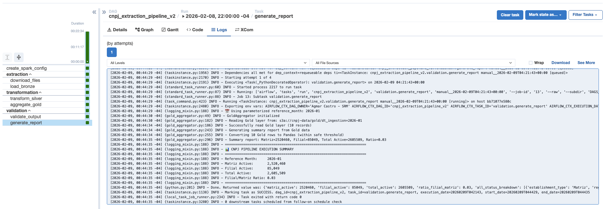

# CNPJ Data Extraction Pipeline

> Production-ready CNPJ data extraction pipeline that downloads Federal Revenue data, filters Sao Paulo establishments, and aggregates active Matriz vs. Filial counts using Medallion Architecture (Bronze > Silver > Gold).

[](https://www.python.org/downloads/)
[](https://spark.apache.org/)
[](https://airflow.apache.org/)
[](https://docs.docker.com/compose/)

## Overview

This pipeline extracts and processes Brazilian Federal Revenue CNPJ (business registry) data to answer the business question:

**"How many active Matriz (headquarters) vs. Filial (branches) establishments are registered in Sao Paulo city?"**

It processes **60M+ establishment records** from 10 source files (~7 GB compressed), filters to Sao Paulo city (~2-4M records), and produces aggregated counts by establishment type and registration status.

### Key Design Decisions

- **Medallion Architecture**: Bronze (raw) > Silver (filtered/standardized) > Gold (aggregated) for data quality at each layer
- **MinIO S3A Storage**: All Parquet data stored in S3-compatible object storage via `s3a://` protocol, eliminating Docker bind mount issues
- **Explicit Schema**: No `inferSchema` -- all 30 CSV fields defined upfront to avoid costly full-file scans
- **Predicate Pushdown**: Sao Paulo filter pushed down to Parquet reader for I/O optimization

## Architecture

```
                         CNPJ EXTRACTION PIPELINE
+---------------------------------------------------------------------+
|                                                                       |
|  [Federal Revenue] --(WebDAV)--> [Ingestion] --(ZIP)--> [Extract]    |
|       (Nextcloud)                     |                               |
|                                       v                               |
|                              +----------------+                       |
|                              |  BRONZE LAYER  |  Raw CSV -> Parquet   |
|                              |  60M+ records  |  s3a://cnpj-data/     |
|                              +-------+--------+  bronze/              |
|                                      |                                |
|                                      v                                |
|                              +----------------+                       |
|                              |  SILVER LAYER  |  SP filter + mapping  |
|                              |  2-4M records  |  s3a://cnpj-data/     |
|                              +-------+--------+  silver/              |
|                                      |                                |
|                                      v                                |
|                              +----------------+                       |
|                              |   GOLD LAYER   |  Aggregations         |
|                              |  <100 records  |  s3a://cnpj-data/     |
|                              +----------------+  gold/                |
|                                                                       |
+---------------------------------------------------------------------+

Infrastructure:
+----------+  +---------------+  +-------+  +-------+  +---------+
| Airflow  |  | Spark Master  |  | Spark |  | MinIO |  | Postgres|
| (sched + |  | + History     |  | Work- |  | (S3)  |  | (meta)  |
|  websvr) |  |   Server      |  | ers   |  |       |  |         |
+----------+  +---------------+  +-------+  +-------+  +---------+
```

### Data Flow

1. **Ingestion**: Download ZIP files from Federal Revenue via WebDAV (Nextcloud public share)
2. **Bronze**: Raw CSV > Parquet with schema validation (30 fields, Snappy compression)
3. **Silver**: Filter Sao Paulo (municipio=7107) + map status/type codes + CNPJ concatenation
4. **Gold**: Aggregate by `establishment_type x registration_status`

## Features

- **Medallion Architecture** -- Bronze > Silver > Gold with validation at each layer
- **PySpark distributed processing** for 60M+ records across Spark cluster
- **S3A object storage** via MinIO (auto-created bucket on startup)
- **Adaptive Query Execution (AQE)** for runtime query optimization
- **Column pruning** -- Silver reads only 11 of 30 Bronze columns (63% I/O reduction)
- **ISO-8859-1 encoding** handling for Brazilian Federal Revenue CSV files
- **3-layer validation framework** (input, business, output)
- **Docker Compose orchestration** with health checks and resource limits
- **Apache Airflow DAG** scheduling with Spark cluster submission
- **Spark History Server** for post-execution job analysis


## Quick Start

### Prerequisites

- Docker and Docker Compose (BuildKit enabled)
- 20GB+ disk space for data
- 8GB+ RAM recommended (cluster uses ~6GB total)

### 1. Configure Environment

```bash
cd docker
cp .env.example .env
# Edit .env with secure passwords (see comments in .env.example)
```

### 2. Build and Start Infrastructure

```bash
cd docker
docker compose build
docker compose up -d
```

This starts 8 services:

| Service | Port | Description |
|---------|------|-------------|
| Spark Master | 8080 | Spark cluster manager UI |
| Spark Workers (x2) | -- | Distributed processing (2GB each) |
| Spark History Server | 18080 | Completed job analysis |
| Airflow Webserver | 8081 | DAG management UI |
| Airflow Scheduler | -- | DAG execution + Spark driver |
| MinIO | 9000/9001 | S3-compatible object storage |
| PostgreSQL | 5432 | Airflow metadata database |
| MinIO Init | -- | Auto-creates `cnpj-data` bucket |

### 3. Access Services

| Service | URL | Credentials |
|---------|-----|-------------|
| Airflow UI | http://localhost:8081 | Set in `.env` (`AIRFLOW_ADMIN_USER`/`AIRFLOW_ADMIN_PASSWORD`) |
| Spark Master UI | http://localhost:8080 | No auth |
| Spark History Server | http://localhost:18080 | No auth |
| MinIO Console | http://localhost:9001 | Set in `.env` (`MINIO_ROOT_USER`/`MINIO_ROOT_PASSWORD`) |

### 4. Run Pipeline

```bash
# Via Airflow (recommended)
docker exec srm-airflow-scheduler airflow dags trigger cnpj_extraction_pipeline_v2

###  Verify Data in MinIO

Open http://localhost:9001, navigate to the `cnpj-data` bucket, and verify:
- `bronze/dt_ingestion=YYYY-MM-DD/` -- Raw Parquet files
- `silver/dt_ingestion=YYYY-MM-DD/` -- Filtered Parquet files
- `gold/dt_ingestion=YYYY-MM-DD/` -- Aggregated Parquet files

## Configuration

### Environment Variables

All configuration is managed via `.env` file (see [.env.example](docker/.env.example)):

```bash
# Storage (S3A via MinIO)
S3_ENDPOINT=http://minio:9000
S3_ACCESS_KEY=changeme_minio_admin
S3_SECRET_KEY=changeme_strong_password_here
S3_BUCKET=cnpj-data

# Data Layer Paths (S3A URIs)
BRONZE_LAYER_PATH=s3a://cnpj-data/bronze
SILVER_LAYER_PATH=s3a://cnpj-data/silver
GOLD_LAYER_PATH=s3a://cnpj-data/gold

# Spark Cluster
SPARK_MASTER_URL=spark://spark-master:7077
SPARK_WORKER_MEMORY=2G
SPARK_WORKER_CORES=2

# Airflow
AIRFLOW_FERNET_KEY=<generate with: python -c "from cryptography.fernet import Fernet; print(Fernet.generate_key().decode())">
AIRFLOW_WEBSERVER_SECRET_KEY=<generate with: openssl rand -hex 32>
```

### Configuration Dataclasses

Pipeline configuration is managed through Python dataclasses in [config.py](src/pipeline_srm/config.py):

| Class | Responsibility |
|-------|---------------|
| `DownloadConfig` | WebDAV URLs, share token, download directory |
| `SparkConfig` | Executor/driver memory, AQE, shuffle partitions, S3A settings |
| `PipelineConfig` | Layer paths, business constants, validation thresholds |
| `GlobalConfig` | Combines all config components |

All configs support environment variable overrides via `__post_init__`.

## Data Source

| Attribute | Value |
|-----------|-------|
| **Source** | Federal Revenue of Brazil (Receita Federal) |
| **Access** | Nextcloud public share via WebDAV |
| **Files** | `Estabelecimentos0.zip` through `Estabelecimentos9.zip` |
| **Size** | ~7 GB compressed, ~25 GB uncompressed |
| **Format** | CSV, semicolon delimiter (`;`), ISO-8859-1 encoding |
| **Records** | 60M+ establishment records across Brazil |
| **Schema** | 30 fields per record (CNPJ, status, type, address, etc.) |

## Business Logic

### Critical Constants

| Constant | Value | Usage |
|----------|-------|-------|
| Sao Paulo Code | `7107` | Federal Revenue 4-digit city code (NOT 7-digit IBGE) |
| Matriz | Code `1` | Headquarters establishment |
| Filial | Code `2` | Branch establishment |
| Active Status | Code `2` | Maps to `ATIVA` label |

### Status Code Mapping

| Code | Label | Description |
|------|-------|-------------|
| 1 | NULA | Null registration |
| 2 | ATIVA | Active (key business metric) |
| 3 | SUSPENSA | Suspended |
| 4 | INAPTA | Unfit |
| 8 | BAIXADA | Closed |

### Establishment Type Mapping

| Code | Label | Description |
|------|-------|-------------|
| 1 | Matriz | Headquarters |
| 2 | Filial | Branch |

## Project Structure

```
Projeto_SRM/
├── src/pipeline_srm/           # Pipeline source code
│   ├── ingestion/
│   │   └── downloader.py       # CNPJDownloader (WebDAV + ZIP extraction)
│   ├── bronze/
│   │   └── bronze_loader.py    # BronzeLoader (CSV -> Parquet)
│   ├── silver/
│   │   └── silver_transformer.py  # SilverTransformer (filter + mapping)
│   ├── gold/
│   │   └── gold_aggregator.py  # GoldAggregator (aggregation + reporting)
│   └── validation/
│       ├── input_validator.py  # Bronze layer validation
│       ├── business_validator.py  # Silver layer validation
│       └── output_validator.py # Gold layer validation
├── dags/
│   └── cnpj_extraction_dag.py  # Airflow DAG (cnpj_extraction_pipeline_v2)
├── docker/
    ├── Dockerfile.spark        # Spark image (+ hadoop-aws JARs for S3A)
    ├── Dockerfile.airflow      # Airflow image (+ hadoop-aws JARs for S3A)
    ├── docker-compose.yml      # Full infrastructure (8 services)
    ├── .env.example            # Environment template
    ├── requirements-spark.txt  # Spark Python dependencies
    └── requirements-airflow.txt  # Airflow Python dependencies

```
## Execution Results

After the DAG completes, you can verify the success of the pipeline through the Airflow logs or the final report generated in the validation.generate_report task

### Final Summary Report:

As shown in the execution logs above, the pipeline provides a clear business summary:

- Reference Month: Successfully processed the 2026-01 period.

- Active Establishments: Identified ~2.5M active Matrix records and ~85k active Filial records.

- Validation Pass: Both Business and Output validation layers returned True, ensuring data quality standards were met.



*Figura 1: Orquestração da Pipeline de CNPJ*


## Validation Framework

### 1. Input Validator (Bronze)

- ZIP file integrity verification
- CSV schema completeness (30 fields)
- Minimum record count (10M+)
- Null rate threshold (<5%)
- Corrupt record detection (PERMISSIVE mode)

### 2. Business Validator (Silver)

- Only Sao Paulo establishments (municipio=7107)
- Valid establishment types (Matriz/Filial only)
- Valid registration statuses (mapped codes)
- CNPJ format validation (14 digits)
- Record count within expected range (1M-10M for SP)
- Filial/Matriz ratio range (0.01-1.0) -- most businesses are Matriz-only

### 3. Output Validator (Gold)

- Aggregation sum matches Silver count
- No null keys in groupBy columns
- Active count > 0
- Stability vs previous execution (+/-10%)

## Performance

### Optimization Strategies

| Strategy | Layer | Impact |
|----------|-------|--------|
| Explicit schema (no inferSchema) | Bronze | Avoids full-file scan |
| Snappy compression | Bronze | ~2x compression ratio |
| Column pruning (11/30 cols) | Silver | 63% I/O reduction |
| Predicate pushdown | Silver | Filter at Parquet scan |
| AQE (Adaptive Query Execution) | All | Runtime plan optimization |
| Coalesce to 1 partition | Gold | Single file for small data |
| Cache + unpersist pattern | Silver/Gold | Reuse without memory leak |

### Resource Allocation

| Container | CPU | Memory |
|-----------|-----|--------|
| Spark Master | 1.0 | 1 GB |
| Spark Worker (x2) | 2.0 | 2 GB |
| Spark History Server | 0.5 | 512 MB |
| Airflow Webserver | 1.0 | 1 GB |
| Airflow Scheduler | 1.5 | 1.5 GB |
| MinIO | 1.0 | 1 GB |
| PostgreSQL | 1.0 | 1 GB |

## Troubleshooting

### Docker Issues

```bash
# View service logs
docker compose -f docker/docker-compose.yml logs -f spark-master
docker compose -f docker/docker-compose.yml logs -f airflow-scheduler

# Check all services health
docker compose -f docker/docker-compose.yml ps

# Full rebuild (after Dockerfile changes)
docker compose -f docker/docker-compose.yml build --no-cache
docker compose -f docker/docker-compose.yml up -d
```

### S3A / MinIO Issues

```bash
# Verify bucket was created
docker exec srm-minio-init mc ls myminio/cnpj-data

# Test S3A connectivity from Spark
docker exec -it srm-spark-master pyspark
>>> spark.range(10).write.parquet("s3a://cnpj-data/test")
>>> spark.read.parquet("s3a://cnpj-data/test").show()
```

### Common Issues

| Problem | Solution |
|---------|----------|
| **OOM on Spark workers** | Increase `SPARK_WORKER_MEMORY` in `.env` |
| **Encoding errors in Bronze** | Verify CSV is ISO-8859-1 (not UTF-8) |
| **S3A connection refused** | Check MinIO is healthy: `docker compose ps` |
| **Missing hadoop-aws JARs** | Rebuild images: `docker compose build --no-cache` |
| **Airflow can't reach Spark** | Check `SPARK_MASTER_URL` in `.env` matches cluster |


## License

This project is for educational and analytical purposes using publicly available Federal Revenue data.


## Author

**Agmar Castro** - [LinkedIn](https://www.linkedin.com/in/agmar-castro/) | [Repository](https://github.com/agmarcastro/case-srm)